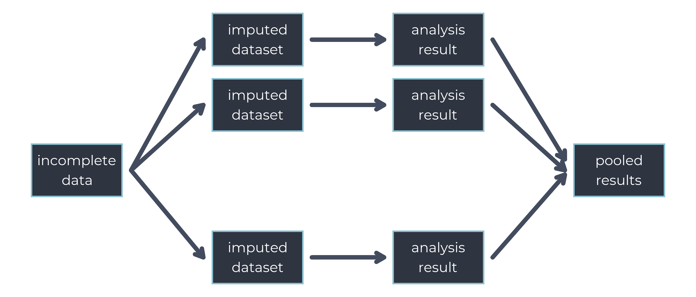

count: false

layout: true

<div class="my-footer"><span>
<a href="https://twitter.com/N_Erler"><i class="fab fa-twitter"></i> N_Erler</a>
&emsp;&emsp;&emsp;&emsp;
<a href="https://github.com/NErler"><i class="fab fa-github"></i> NErler</a> &emsp;&emsp;&emsp;&emsp;
<a href = "https://nerler.com"><i class="fas fa-globe-americas"></i> nerler.com</a>
</span></div> 

```{r setup, include = FALSE}
knitr::opts_chunk$set(echo = FALSE, out.width = "100%", dpi = 600,
                      fig.height = 3.3,
                      dev.args = list(type = "cairo", antialias = "none",
                                      bg = "transparent"))

# ErasmusMC::export_slides(png = TRUE)
# script = ErasmusMC::get_speaker_notes("index.html", export = FALSE)


library("kableExtra")

options(digits = 4)

library("JointAI")

library("knitr")
xaringanExtra::use_tile_view()
xaringanExtra::use_fit_screen()
xaringanExtra::use_share_again()
```


```{r xaringan-themer, include=FALSE, warning=FALSE, fig.showtext = TRUE}
library("xaringanthemer")
library("ggplot2")

nord0 = "#2E3440"
nord1 = "#3B4252"
nord2 = "#434C5E"
nord3 = "#4C566A"

## Snow Storm colors
nord4 = "#D8DEE9"
nord5 = "#E5E9F0"
nord6 = "#ECEFF4"

## Frost colors
nord7 = "#8FBCBB"
nord8 = "#88C0D0"
nord9 = "#81A1C1"
nord10 = "#5E81AC"

## Aurora colors
nord11 = "#BF616A"
nord12 = "#D08770"
nord13 = "#EBCB8B"
nord14 = "#A3BE8C"
nord15 = "#B48EAD"


theme_set(theme_xaringan(css_file = "resources/EMC_dark.css",
                         text_font_size = 8,
                         title_font_size = 12))

theme_update(panel.grid = element_blank(),
             panel.border = element_rect(fill = NA, color = nord2),
             axis.line = element_line(color = nord2, size = 0.1),
             axis.ticks = element_line(color = nord2),
             panel.background = element_rect(fill = "transparent",
                                             color = "transparent"),
             plot.background = element_rect(fill = "transparent",
                                            color = "transparent"),
             strip.background = element_rect(fill = nord2, colour = nord2),
             strip.text = element_text(color = nord4, face = "bold",
                                       margin = unit(c(1.5, 0, 1.5, 0),
                                                     units = "mm")),
             legend.background = element_blank(),
             legend.text = element_text(color = nord4),
             legend.key = element_blank()
)

```

---
count: false


## Outline


* Motivating Example

* Standard Approach to Imputation
  * Associated Issues
  
* Fully Bayesian Approach
  * Theory
  * Implementation in the <i class="fab fa-r-project"></i> Package JointAI
  * Extensions to More Complex Settings:<br>
    Multivariate Joint Model for Longitudinal and Survival Data
    
* More Info on JointAI

???

To give you a bit of an **idea where we are headed** and what to expect, here
a quick overview.

I will start with a **motivating example** from my work with the department of
Gastroenterology & Hepatology at the Erasmus Medical Center and then take a 
look at **what method would usually be applied** to handle the missing values in
this type of setting, and what the **issues** are that we have with this approach
and **why we need an alternative.**

You will be familiar with much of this, but I think it is relevant to **get some
context** and to get **familiar with my notation**.

We'll then have a look at a **fully Bayesian alternative**.

This approach is **implemented in the R package JointAI** and I'll show you 
briefly how we could **analyse the motivating example** using JointAI, and
how this **approach and implementation works for even more complex settings**, specifically a multivariate joint model for longitudinal and survival data.

And if there is still time, we can have a more in depth look into what else
you can do with JointAI.

**Slides on Website**

---

## Example: PSC Recurrence & Survival

.footnote[
[<i class = "fas fa-file-alt"></i> Visseren, Erler et al. (2021)](https://doi.org/10.1111/tri.13925)
]


1549 patients received a liver transplant (LTx) to "cure" PSC
* 288 patients had a 2<sup>nd</sup> LTx
* 34 patients had a 3<sup>rd</sup> LTx
* 8 patients had a 4<sup>th</sup> LTx
  
**Covariate of interest:** recurrence of PSC

&#8680; graft number & recurrence are time-varying covariates

???

PSC, short for **Primary Sclerosing Cholangitis**, is a liver disease.
The mechanisms behind this disease are not yet fully known there is
currently no cure but doctors can only try and treat the patient's symptoms.

For advanced or complicated cases, **liver transplant is the only potentially
curative treatment**, but in 10 - 30% of patients the **disease recurs** in the
new organ.

We had data from the European Liver Transplant Registry of **1549 patients
who did receive a liver transplant for PSC**, and several of these patients
actually received a second, third or even fourth transplant.

The covariate of interest in our analysis was **recurrence of PSC** and in our
analysis we wanted to include both **recurrence and the graft number as
time-varying covariates.**

- - -

--

**Additionally**: 8 (time-constant) covariates
* 3 incomplete (4% - 11% NA)
* 88% complete cases

???

In addition, we had **8 additional, time-constant covariates**, of which **3 had
missing values** in up to 11% of the cases. 

- - -

--

<div style = "width: 35%; padding: 1.15em 2em; background-color: var(--nord0); position: absolute; bottom: 80px; right: 60px;">
<strong>&#8680; time-dependent PH model</strong>
</div>

???

So the analysis that would **typically** be performed if there were no missing 
values (or by ignoring cases with missing values) would be a **time-dependent
Cox model**.

---

## Example: PSC Recurrence & Survival

```{r patsurv, echo = FALSE, warning = FALSE}
PSCdat <- data.frame(time = c(0, 2, 5, 8, 15),
                     recurrence = 0,
                     graftnr = 1)

PSCdat$recurrence[PSCdat$time >= 5] <- 1
PSCdat$graftnr[PSCdat$time >= 2] <- 2
PSCdat$graftnr[PSCdat$time >= 8] <- 3

p_rec1 <- ggplot(PSCdat, aes(x = time, y = recurrence)) +
  geom_point(color = nord4) +
  geom_step(color = nord4) +
  scale_x_continuous(name = "follow-up time",
                     breaks = PSCdat$time,
                     labels = c("baseline\nLTx", "LTx", "recurrence",
                                "LTx", "death")) +
  scale_y_continuous(name = "recurrence\nof PSC",
                     breaks = unique(PSCdat$recurrence),
                     labels = c(dQuote("healthy"), "recurence")) +
  theme(axis.text = element_text(color = nord4))

p_graftnr1 <- ggplot(PSCdat, aes(x = time, y = graftnr)) +
  geom_point(color = nord4) +
  geom_step(color = nord4) +
  scale_x_continuous(name = "follow-up time",
                     breaks = PSCdat$time,
                     labels = c("baseline\nLTx", "LTx", "recurrence",
                                "LTx", "death")) +
  scale_y_continuous(name = "graft number",
                     breaks = unique(PSCdat$graftnr),
                     labels = paste0("graft ", unique(PSCdat$graftnr))) +
  theme(axis.text = element_text(color = nord4),
        axis.title.x = element_blank())

cowplot::plot_grid(p_rec1, p_graftnr1, nrow = 2, align = "v")
```

???

To make it a bit more clear how this time-varying structure looks like I
tried to visualize it here.

All patients receive a transplant because of their PCS and that is where
the follow-up time starts.

At some point, some of the patients have recurrence and we have a variable in the data that then changes from 0 to 1.

And during follow-up patients may also receive additional transplants, either
because of the PSC or due to other reasons, and we have a count variable that for every one starts with the value 1, and then increases to 2 and later to 3 whenever a patient has another transplant.

We follow the patients until they die or until the end of follow-up which was the time when the data was extracted from the registry.

---


## How to Handle the Missing Values?

Default: **Multiple Imputation**



???

The **most common** way to handle missing values in covariates is **multiple 
imputation**.

This refers to the general principle that we impute the missing values multiple
times, fill them into the original, incomplete data to create multiple completed
datasets that we can then analyse using standard methods.

<div style = "color: grey;">
In the end, we need to pool the results from the separate analyses to create one
overall result that takes into account both the uncertainty that we have about
the parameter estimates from each of the analyses, measured by the standard
errors, and the additional uncertainty due to the missing values, which is
measured by the variation between the results from the different imputations.
</div>

---

## Imputation Step

<div style = "width: 75%; padding: 1.15em 2em; background-color: var(--nord0); margin: auto; display: block;">
Sample from the <strong>predictive distribution</strong> of the <span style = "font-weight: bold; color: var(--nord15);">missing
values</span> given the <strong>observed values</strong>.
</div>

.footnote[
assuming <span style="font-weight: bold;">ignorable missingness</span> in a covariate $x$

[<i class = "fas fa-book"></i> Rubin (2004)](https://doi.org/10.1198/000313004X6355)]

???

The critical, or **most interesting** part of this is the **imputation step**. 

When Donald Rubin developed multiple imputation in the 1970s, he realized that **imputed values have to be sampled from the predictive
distribution of the missing values given the observed values**.

This is an inherently **Bayesian idea**. The way I see it, multiple imputation is
**based on Bayesian reasoning** but instead of working with the full posterior
distribution it only uses a **hand full of samples** for practical purposes.


- - -
--

<br>

\begin{align*}
p(\color{var(--nord15)}{\mathbf x} \mid \text{everything else}) = p(\color{var(--nord15)}{\mathbf x} \;\mid\; & \text{outcome},\\
& \text{other covariates},\\
&\text{parameters})
\end{align*}

???

That means we need to **sample** the **imputed values for an incomplete
covariate $x$** from a **distribution for $x$ conditional on everything else**,
where "everything else" includes the outcome/response, other covariates, and
parameters.


---

## Imputation Step


.flex-grid[
.col[

<table class="data-table">
<tr>
<th></th>
<th>\(\mathbf y\)</th>
<th>\(\color{var(--nord15)}{\mathbf x_1}\)</th>
<th>\(\mathbf x_2\)</th>
<th>\(\mathbf x_3\)</th>
</tr>
<tr><td></td><td colspan = "4"; style = "padding: 0px;"><hr /></td><tr>
<td class="rownr"></td>
<td><i class = "fas fa-check"</i></td>
<td><i class = "fas fa-check"</i></td>
<td><i class = "fas fa-check"</i></td>
<td><i class = "fas fa-check"</i></td>
</tr>
<tr>
<td class="rownr">\(i\)</td>
<td><i class = "fas fa-check"</i></td>
<td style="color: var(--nord15);"><i class = "fas fa-question"></i></td>
<td><i class = "fas fa-check"</i></td>
<td><i class = "fas fa-check"</i></td>
</tr>
<tr>
<td class="rownr"></td>
<td><i class = "fas fa-check"</i></td>
<td><i class = "fas fa-check"</i></td>
<td><i class = "fas fa-check"</i></td>
<td><i class = "fas fa-check"</i></td>
</tr>
<tr>
<td class="rownr"></td>
<td><i class = "fas fa-check"</i></td>
<td><i class = "fas fa-check"</i></td>
<td><i class = "fas fa-check"</i></td>
<td><i class = "fas fa-check"</i></td>
</tr>
<tr>
<td class = "rownr"></td>
<td>\(\vdots\)</td>
<td>\(\vdots\)</td>
<td>\(\vdots\)</td>
<td>\(\vdots\)</td>
</tr>
</table>


* $\mathbf y$: **response** variable
* $\color{var(--nord15)}{\mathbf x_1}$: **incomplete** covariate
* $\mathbf x_2$, $\mathbf x_3$: **complete** covariates

<div style = "width: 450px;"></div>

]


.col[

**Sampling from the predictive distribution:&emsp;&nbsp;&nbsp;&nbsp;&nbsp;&nbsp;**

{{content}}

]
]

???

Let's have a look at this in a **very simple setting** where we have a response
$y$, an incomplete covariate $x_1$ and two completely observed covariates $x_2$
and $x_3$.

- - - - - 

--


Define a model for the incomplete variable
$\color{var(--nord15)}{\mathbf x_1}$, e.g.
$$\color{var(--nord15)}{\mathbf x_1} = \beta_0 + \beta_1 \mathbf y +
\beta_2 \mathbf x_2 + \beta_3 \mathbf x_3 + \varepsilon$$
to get estimates $\boldsymbol{\hat\beta}$ (and $\hat\sigma$)
{{content}}

???

We can **think of sampling from the predictive distribution** of $x_1$ as
**fitting a model for $x_1$** that has the other three variables in the linear predictor, to the cases **where $x_1$ is observed**.

From this model, we can **get estimates** for the regression coefficients
$\beta$ and the standard deviation of the residuals $\sigma$.

- - -

--

<br>

Sample
$\color{var(--nord15)}{\hat{x}_{i1}}$ from the predictive distribution
$$p(\color{var(--nord15)}{x_{i1}} \mid y_i, x_{i2}, x_{i3}, \boldsymbol{\hat\beta}, \hat\sigma)$$

???

And using these parameter estimates we can then **calculate the expected value** of $x_1$ for those cases where $x_1$ is missing.

The **distributional assumption** that we made when we **chose the type of
model** to use,  together with the **expected value** and estimate of the
**standard deviation of the error terms** specifies this predictive distribution
that we need to sample imputations for the missing values in $x_1$ from.


---

## Multiple Imputation using FCS (MICE)

.flex-grid[
.col[

<div style = "text-align: center; margin-bottom: 25px;">
<strong>Multivariate<br>Missingness</strong></div>


<table class="data-table">
<tr>
<th></th>
<th>\(\mathbf y\)</th>
<th>\(\color{var(--nord15)}{\mathbf x_1}\)</th>
<th>\(\color{var(--nord15)}{\mathbf x_2}\)</th>
<th>\(\color{var(--nord15)}{\mathbf x_3}\)</th>
<th>\(\ldots\)</th>
</tr>
<tr><td></td><td colspan = "5"; style = "padding: 0px;"><hr /></td><tr>
<td class="rownr"></td>
<td><i class = "fas fa-check"</i></td>
<td><i class = "fas fa-check"</i></td>
<td><i class = "fas fa-check"</i></td>
<td style="color: var(--nord15);"><i class = "fas fa-question"></i></td>
<th>\(\ldots\)</th>
</tr>
<tr>
<td class="rownr">\(i\)</td>
<td><i class = "fas fa-check"</i></td>
<td style="color: var(--nord15);"><i class = "fas fa-question"></i></td>
<td><i class = "fas fa-check"</i></td>
<td><i class = "fas fa-check"</i></td>
<th>\(\ldots\)</th>
</tr>
<tr>
<td class="rownr"></td>
<td><i class = "fas fa-check"</i></td>
<td style="color: var(--nord15);"><i class = "fas fa-question"></i></td>
<td style="color: var(--nord15);"><i class = "fas fa-question"></i></td>
<td><i class = "fas fa-check"</i></td>
<th>\(\ldots\)</th>
</tr>
<tr>
<td class="rownr"></td>
<td><i class = "fas fa-check"</i></td>
<td><i class = "fas fa-check"</i></td>
<td><i class = "fas fa-check"</i></td>
<td><i class = "fas fa-check"</i></td>
<th>\(\ldots\)</th>
</tr>
<tr>
<td class = "rownr"></td>
<td>\(\vdots\)</td>
<td>\(\vdots\)</td>
<td>\(\vdots\)</td>
<td>\(\vdots\)</td>
<td></td>
</tr>
</table>

]


.col[

<div style = "width: 700px;">
&#8680; \(p(\color{var(--nord15)}{\mathbf X_{mis}} \mid \text{everything else})\)
is <strong>multivariate</strong>.
</div>

{{content}}

]
]

???

In practice, we usually do not have missing values in just a single variable,
but in **multiple variables**, and the **predictive distribution** is then **multivariate**.

When the incomplete **variables are of mixed type**, meaning continuous and
categorical, this multivariate distribution does **not have a closed form** and
things get a bit more complicated.

- - -

--

<br>

**Most common approach:**<br>
<span style = "font-weight: bold;">MICE</span> 
  <span style = "color: var(--lgrey);">(multivariate imputation by chained equations)</span><br>
  <span style = "font-weight: bold;">FCS</span> 
  <span style = "color: var(--lgrey);">(fully conditional specification), i.e.,</span>
  

<div>
\begin{alignat}{10}
\color{var(--nord15)}{\mathbf x_1} &= \beta_0 &+& \beta_1 \mathbf y &+&
\beta_2 \color{var(--nord15)}{\mathbf x_2} &+& \beta_3 \color{var(--nord15)}{\mathbf x_3} &+& \ldots &+& \boldsymbol\varepsilon \\
\color{var(--nord15)}{\mathbf x_2} &= \alpha_0 &+& \alpha_1 \mathbf y &+&
\alpha_2 \color{var(--nord15)}{\mathbf x_1} &+& \alpha_3 \color{var(--nord15)}{\mathbf x_3} &+& \ldots &+& \boldsymbol\varepsilon \\
\color{var(--nord15)}{\mathbf x_3} &= \theta_0 &+& \theta_1 \mathbf y &+&
\theta_2 \color{var(--nord15)}{\mathbf x_1} &+& \theta_3 \color{var(--nord15)}{\mathbf x_2} &+& \ldots &+& \boldsymbol\varepsilon
\end{alignat} 
</div>

<p class = "smallbreak">&nbsp;</p>

* iterative
* based on the idea of the Gibbs sampler


???

The most common approach to solve this issue is MICE, short for
**multivariate imputation by chained equations**, also called 
**fully conditional specification**.

The principle is a **direct extension** to what we've seen on the previous slide:
We impute missing values using models that have all other data in their linear
predictor.

Because in these imputation **models condition on unobserved values**, we have
to use an **iterative algorithm** that starts by **randomly drawing initial
values** from the observed part of the data, and then **cycles through the
incomplete variables** and imputes one at a time.

This algorithm is based on the **idea of the Gibbs sampler** which creates a
**sample from a multivariate distribution** by iteratively sampling from a **set
of univariate full-conditional distributions**.

---

## Time-to-Event Outcomes


.pull-left[
(Simple) **Proportional Hazards Model:**
$$h(t) = h_0(t) \exp\left(\color{var(--nord15)}{\mathbf X} \boldsymbol\beta\right)$$

<br>

<ul style = "color: var(--nord4);">
<li>\(h(t)\): hazard function</li>
<li>\(h_0(t)\): baseline hazard</li>
<li>\(\color{var(--nord15)}{\mathbf X} = (\mathbf x_1, \mathbf x_2, \ldots)\): (in)complete covariates</li>
<br><br>
<li>\(\mathbf T\): observed event / censoring time</li>
<li>\(\boldsymbol\delta\): event indicator</li>
</ul>
]


.pull-right[

<br>

<table class="data-table">
<tr>
<th></th>
<th>\(\mathbf T\)</th>
<th>\(\boldsymbol\delta\)</th>
<th>\(\color{var(--nord15)}{\mathbf x_1}\)</th>
<th>\(\color{var(--nord15)}{\mathbf x_2}\)</th>
<th>\(\ldots\)</th>
</tr>
<tr><td></td><td colspan = "5"; style = "padding: 0px;"><hr /></td><tr>
<td class="rownr"></td>
<td><i class = "fas fa-check"</i></td>
<td><i class = "fas fa-check"</i></td>
<td><i class = "fas fa-check"</i></td>
<td style="color: var(--nord15);"><i class = "fas fa-question"></i></td>
<th>\(\ldots\)</th>
</tr>
<tr>
<td class="rownr">\(i\)</td>
<td><i class = "fas fa-check"</i></td>
<td><i class = "fas fa-check"</i></td>
<td style="color: var(--nord15);"><i class = "fas fa-question"></i></td>
<td><i class = "fas fa-check"</i></td>
<th>\(\ldots\)</th>
</tr>
<tr>
<td class="rownr"></td>
<td><i class = "fas fa-check"</i></td>
<td><i class = "fas fa-check"</i></td>
<td style="color: var(--nord15);"><i class = "fas fa-question"></i></td>
<td><i class = "fas fa-check"</i></td>
<th>\(\ldots\)</th>
</tr>
<tr>
<td class="rownr"></td>
<td><i class = "fas fa-check"</i></td>
<td><i class = "fas fa-check"</i></td>
<td><i class = "fas fa-check"</i></td>
<td><i class = "fas fa-check"</i></td>
<th>\(\ldots\)</th>
</tr>
<tr>
<td class = "rownr"></td>
<td>\(\vdots\)</td>
<td>\(\vdots\)</td>
<td>\(\vdots\)</td>
<td>\(\vdots\)</td>
<td></td>
</tr>
</table>

]

???

How does this look like when we have **survival data** like in our motivating 
example.

When we use the **Cox model**, we model the **hazard function**, and here I
consider only the **simple setting** in which we do not have time-varying
covariates.

$\mathbf X$ refers to the **design matrix** which contains completely observed
and incomplete covariates.


But the **data** that we use to fit such a model, **does not contain the hazard**
as a response variable. Instead, we have the **time of the event** or censoring, 
and the **event indicator $\delta$**.

---


## Time-to-Event Outcomes

<br>

Using FCS (naively), the **imputation model** for
$\color{var(--nord15)}{\mathbf x_1}$ would be
$$\color{var(--nord15)}{\mathbf x_1} = \theta_0 + \theta_1 \mathbf T + \theta_2  \boldsymbol\delta + \theta_3 \color{var(--nord15)}{\mathbf x_2} + \theta_4 \color{var(--nord15)}{\mathbf x_3} + \ldots,$$
i.e., assume a **linear association** between $\color{var(--nord15)}{\mathbf x_1}$
and $\mathbf T$ and $\boldsymbol\delta$.

.footnote[
[<i class = "fas fa-file-alt"></i> White & Royston (2009)](https://doi.org/10.1002/sim.3618)
&nbsp;
[<i class = "fas fa-file-alt"></i> Bartlett et al. (2015)](https://doi.org/10.1177/0962280214521348)
]

???

When we now use the **MICE algorithm** on survival data, the following happens:

We specify (maybe without knowing it, because the software does it for us)
**imputation models** for the incomplete covariates that look like this:
they **contain the event time and event indicator and all other covariates in its linear predictor.

At first glance, this **seems OK**, because we have specified a full conditional
distribution.

But this model **assumes** that there is a **linear association** between the
incomplete covariate $x_1$ and the event time and event indicator.

- - -

--

<br>

This is **inconsistent** with the log-likelihood of the **proportional hazards model**:

$$p(\mathbf T, \boldsymbol \delta \mid \color{var(--nord15)}{\mathbf X}, \boldsymbol\beta) =
\boldsymbol\delta \left(\log h_0(T) + \color{var(--nord15)}{\mathbf X} \boldsymbol\beta\right) - 
\int_0^T h_0(s)\exp\left(
\color{var(--nord15)}{\mathbf X} \boldsymbol\beta\right)ds$$

???

But the **log-likelihood of the proportional hazards model** makes a **different
assumption**.

Our **analysis model implies** that there is a **non-linear association**
between covariates and the event time and indicator.

So we have specified a full-conditional distribution as our imputation model, 
but **not the correct full-conditional distribution**.

The **implication** of this becomes more clear when we look at a **simpler
example** that can be visualized more easily.

---

## A Simple Example

```{r, echo = FALSE}
set.seed(2020)
x <- runif(150, -3, 4)
y1 <- x + rnorm(length(x), 0, 1)
y2 <- x + x^2 + rnorm(length(x), 0, 1.5)

y3 <- runif(100, min(y2), max(y2))

mod <- lm(x ~ y2)
pred <- predict(mod, newdata = data.frame(y2 = y3))
imp <- pred + rnorm(length(pred), 0, sigma(mod))

p <- ggplot(data.frame(x = y1, y = x), aes(x = x, y = y)) +
  geom_point(size = 1.5, color = nord4, alpha = 0.3) +
  ylab(expression(x[1])) +
  theme(
    axis.title.y = element_text(color = nord15),
    axis.text = element_blank(),
    axis.ticks = element_blank()
  ) +
  xlab("y")

p2 <- p %+% data.frame(x = x, y = y2) +
  xlab(expression(x[1])) +
  ylab("y") +
  theme(axis.title.x = element_text(color = nord15),
        axis.title.y = element_text(color = nord4))


p3 <- ggplot(data.frame(y = y2, x = x),
             aes(x = x, y = y)) +
  geom_point(size = 2, aes(color = "obs", shape = "obs"), alpha = 0.6) +
  geom_point(data = data.frame(x = imp, y = y3),
             aes(x = x, y = y, color = "imp", shape = "imp"),
             size = 2, alpha = 0.9) +
  xlab(expression(x[1])) +
  ylab("y") +
  scale_color_manual(name = "",
                     limits = c("obs",  "imp"),
                     labels = c("observed (true)", "imputed"),
                     values = c("#D8DEE9", "#8FBCBB")) +
  scale_shape_manual(name = "",
                     limits = c("obs", "imp"),
                     labels = c("observed (true)", "imputed"),
                     values = c(19, 5)) +
  coord_cartesian(ylim = range(y2)) +
  theme(axis.title.x = element_text(color = nord15),
        axis.title.y = element_text(color = nord4),
        axis.text = element_blank(),
        axis.ticks = element_blank())

p4 <- p3 + 
  geom_smooth(se = FALSE, formula = y ~ x + I(x^2), method = "lm",
              aes(color = "obs")) +
  geom_smooth(data = data.frame(x = c(x, imp), y = c(y2, y3)),
              se = FALSE, formula = y ~ x + I(x^2), method = "lm",
              aes(y = y, color = "imp"))

```


.pull-left[
**Implied Assumption:**<br>
<span>Linear association</span>
between $\color{var(--nord15)}{\mathbf x_1}$ and $\mathbf y$:

$$\color{var(--nord15)}{\mathbf x_1} = 
\theta_0 + \bbox[#3B4252, 2pt]{\theta_1 \mathbf y} +
\theta_2 \mathbf x_2 + \theta_3 \mathbf x_3 + \ldots$$


```{r, fig.width = 3.5, fig.height = 2.333}
p
```

]

???

Here I go back to the very simple setting with a **response $y$** and missing
values in the **covariate $x_1$**, and assume both are continuous and can be
modelled using linear regression.

So the **imputation model for $x_1$** is a linear regression that has $y$ in its
linear predictor, and this **implies a linear association** between $x_1$ and
$y$.

- - -
--

.pull-right[
<br>
But what if 
$$\mathbf y = \beta_0 + 
\bbox[#3B4252, 2pt]{\beta_1 \color{var(--nord15)}{\mathbf x_1} +
\beta_2 \color{var(--nord15)}{\mathbf x_1}^2} +
\beta_3 \mathbf x_2 + \ldots$$

```{r, fig.width = 3.5, fig.height = 2.333}
p2
```
]

???

Assume that we do in fact have a non-linear association and that our analysis model includes also a **quadratic term of $x_1$.**

---


## Non-linear Associations

.pull-left[
* <span style="font-weight: bold; color:var(--nord4);">true association</span>: non-linear
* <span style="font-weight: bold; color:var(--nord7);">imputation assumption</span>: linear
]

.pull-right[
]


```{r, fig.width = 6, fig.height = 2.5, out.width = "80%"}
p3
```

???


Because we assumed a linear association in the imputation model, 
all imputed values, here indicated by the greenish diamonds, will follow
this linear association, and the observed data show the true non-linear 
association.

---
count: false
class: animated, fadeIn

## Non-linear Associations

.pull-left[
* <span style="font-weight: bold; color:var(--nord4);">true association</span>: non-linear
* <span style="font-weight: bold; color:var(--nord7);">imputation assumption</span>: linear
]

.pull-right[
<span style="font-size: 56pt; position: relative; right: 110px; bottom: 20px;">} &#8680;</span>
<span style = "color: var(--nord11); font-size: 1.2rem; font-weight: bold; position: relative; bottom: 30px; right: 100px;">
bias!</span>
]


```{r, fig.width = 6, fig.height = 2.5, out.width = "80%"}
p4
```


???


When we now analyse this imputed data we will of course get very different
results than what we would have gotten had the data been complete, even
if we use a model that allows for the correct non-linear association.

The values that have been imputed under the wrong assumption distort the
association and introduce bias.

And the same that we have visualized here for a quadratic effect will also
happen when we use imputation with the MICE algorithm naively with a
time-to-event outcome.


To avoid this bias we would need **imputation models that also assume a
non-linear association**. But it is not going to be straightforward to get the
correct shape of this association because usually we cannot just get the
**inverse of the functional form** used in the analysis model.

---

## Example: PSC Recurrence & Survival


.footnote[
[<i class = "fas fa-file-alt"></i> Erler et al. (2016)](https://doi.org/10.1002/sim.6944)
]

.pull-left[

Recurrence of PSC and graft number are **time-varying variables**:
<ul class = "arrowlist">
<li>the data is in "long" format</li>
<li>multiple rows refer to the same patient</li>
</ul>

{{content}}
]


.pull-right[

<div style = "width: 300px;">&nbsp;</div>

```{r, echo = FALSE}
html_longtab <- r"(<table class="data-table">
<tr>
<th>id</th>
<th>\(\mathbf t_{start}\)</th>
<th>\(\mathbf t_{stop}\)</th>
<th>\(\boldsymbol\delta\)</th>
<th>graft</th>
<th>rPSC</th>
<th>\(\color{var(--nord15)}{\mathbf x_1}\)</th>
<th>\(\color{var(--nord15)}{\mathbf x_2}\)</th>
<th>\(\ldots\)</th>
</tr>
<tr><td colspan = "9"; style = "padding: 0px;"><hr /></td><tr>
<td class="rownr"></td>
<td><i class = "fas fa-check"</i></td>
<td><i class = "fas fa-check"</i></td>
<td><i class = "fas fa-check"</i></td>
<td><i class = "fas fa-check"</i></td>
<td><i class = "fas fa-check"</i></td>
<td><i class = "fas fa-check"</i></td>
<td><i class = "fas fa-check"</i></td>
<td>\(\ldots\)</td>
</tr>
<tr class="hlgt-row">
<td class="rownr">\(i\)</td>
<td>0</td>
<td>2.7</td>
<td>0</td>
<td>1</td>
<td>no</td>
<td style="color: var(--nord15);"><i class = "fas fa-question"></i></td>
<td><i class = "fas fa-check"</i></td>
<td>\(\ldots\)</td>
</tr>
<tr class = "hlgt-row">
<td class="rownr">\(i\)</td>
<td>2.7</td>
<td>3.2</td>
<td>0</td>
<td>1</td>
<td>yes</td>
<td style="color: var(--nord15);"><i class = "fas fa-question"></i></td>
<td><i class = "fas fa-check"</i></td>
<td>\(\ldots\)</td>
</tr>
<tr class = "hlgt-row">
<td class="rownr">\(i\)</td>
<td>3.2</td>
<td>6.5</td>
<td>1</td>
<td>2</td>
<td>yes</td>
<td style="color: var(--nord15);"><i class = "fas fa-question"></i></td>
<td><i class = "fas fa-check"</i></td>
<td>\(\ldots\)</td>
</tr>
<tr>
<td class="rownr"></td>
<td><i class = "fas fa-check"</i></td>
<td><i class = "fas fa-check"</i></td>
<td><i class = "fas fa-check"</i></td>
<td><i class = "fas fa-check"</i></td>
<td><i class = "fas fa-check"</i></td>
<td><i class = "fas fa-check"</i></td>
<td style="color: var(--nord15);"><i class = "fas fa-question"></i></td>
<td>\(\ldots\)</td>
</tr>
<tr>
<td class="rownr"></td>
<td><i class = "fas fa-check"</i></td>
<td><i class = "fas fa-check"</i></td>
<td><i class = "fas fa-check"</i></td>
<td><i class = "fas fa-check"</i></td>
<td><i class = "fas fa-check"</i></td>
<td><i class = "fas fa-check"</i></td>
<td style="color: var(--nord15);"><i class = "fas fa-question"></i></td>
<td>\(\ldots\)</td>
</tr>
<tr>
<td class = "rownr"></td>
<td>\(\vdots\)</td>
<td>\(\vdots\)</td>
<td>\(\vdots\)</td>
<td>\(\vdots\)</td>
<td>\(\vdots\)</td>
<td>\(\vdots\)</td>
<td>\(\vdots\)</td>
<td>\(\ddots\)</td>
</tr>
</table>)"

```

```{r, echo = FALSE, results = "asis"}
cat(html_longtab)
```

]

???

And in the motivating example, there is an additional difficulty for imputation.

We have **two time-varying variables**, recurrence of PSC and the graft number.

This means that we will usually have our **data in long format**, so that there
are multiple rows per patient, with the number of rows depending on whether the
patient experienced recurrence and how many transplants he or she got.

Depending on the software implementation, we then have two time variables, I
called them $t_{start}$ and $t_{stop}$ here, that indicate the beginning and the
end of the time interval in which the patient had the values of the covariates
given in that row of the data.

- - -

--

Imputed values of baseline covariates $\color{var(--nord15)}{\mathbf x_1}$,
$\color{var(--nord15)}{\mathbf x_2}$, ... should be **constant across
time/rows**.

**Not** all rows are **independent**<br>
&#8680; violates of model assumption.

???

In our motivating example, the incomplete variables were all time-constant covariates, so the values of these variables should be constant cross the 
different rows of the data belonging to the same patient.

But if we would apply the MICE algorithm to a dataset in long format, the 
imputed values would generally differ across rows. So we would obtain
inconsistent imputed values and introduce bias.

And what we also need to take into account is that rows belonging to the same
patient are not independent. But we apply imputation models to this data
which do assume that all observations are independent.

Violation of this assumption will also result in bias.

---


## Non-linear Associations & Multi-level

In settings with **non-linear associations** and **multi-level data**
the **correct predictive distribution**
$$ p(\color{var(--nord15)}{\mathbf X_{mis}} \mid \text{everything else})$$
may not have a closed form.

<br>


<div style="width: 85%; padding: 1.15em 2em; background-color: var(--nord0); margin: auto; 
display: block; text-align: center;">
<strong><span style="font-size: 1.5rem;">&#8680;</span> 
We cannot easily specify the correct imputation model directly.</strong>
</div>

???

So, in summary, we need to sample imputed values from the predictive
distribution of the missing values given everything else, but whenever we have a
non-linear association between the response and incomplete covariates, as is the
case for time-to-event outcomes, and when we have multi-level data, it is not
straightforward to specify this distribution directly.

When we use MICE, however, this is exactly what we are doing. By using standard
regression models for imputation, we specify **a** distribution of the
incomplete variables given everything else, but **not the correct
distribution**.

---

## Getting the Correct Distribution

???

The interesting question now is: How do we get the correct predictive
distribution?


- - -
--

.flex-grid[
.col[
* We need $\;p(\color{var(--nord15)}{\mathbf X_{mis}} \mid \mathbf y, \ldots)$
* We know $\;p(\mathbf y \mid \color{var(--nord15)}{\mathbf X_{mis}}, \ldots)$
]

.col[
<div style = "color: var(--nord3);">
<ul>
<li>\(\mathbf x\): incomplete covariate(s)</li>
<li>\(\mathbf y\): outcome(s)</li>
<li>\(\ldots\): everything else </li>
</ul>
</div>
]
]

???


Remember: what we need is the distribution of an incomplete variable $x$ conditional on the response and everything else.

But what we do know is the distribution of the response $y$ conditional on the
covariates and everything else, because that's our analysis model.

And here Bayes comes to the rescue. 

- - -
--

**Bayes Theorem:**

\begin{align}
p(\color{var(--nord15)}{\mathbf X_{mis}} \mid \mathbf y, \ldots) &= 
\frac{p(\mathbf y \mid \color{var(--nord15)}{\mathbf X_{mis}}, \ldots)\;
p(\color{var(--nord15)}{\mathbf X_{mis}},\ldots)}{p\left(\mathbf y, \ldots\right)}\\
&\propto p(\mathbf y \mid \color{var(--nord15)}{\mathbf X_{mis}}, \ldots)\;
p(\color{var(--nord15)}{\mathbf X_{mis}},\ldots)
= \underset{\text{joint distribution}}{\underbrace{p(\mathbf y, \color{var(--nord15)}{\mathbf X_{mis}}, \ldots)}} 
\end{align}


???

Because Bayes theorem allows us to convert a conditional distribution into the
reversed conditional.

And using this theorem we derive that the distribution of interest, the
distribution of the incomplete covariate conditional on everything else is
proportional to the distribution of the **response conditional on the
covariates**, and the **joined distribution of the covariates and everything
else**.

The product of these two terms describes the full joint distribution of
everything, all the data, response, covariates, observed or missing, and
parameters.


---

## Factorization of the Joint Distribution

$$p(\mathbf y, \color{var(--nord15)}{\mathbf X}, \boldsymbol\theta) =
\underset{\substack{\text{analysis}\\\text{model}}}{\underbrace{p(\mathbf y \mid \color{var(--nord15)}{\mathbf X}, \boldsymbol\theta)}}\;
\bbox[#2E3440, 5pt]{\underset{\substack{\text{covariate}\\\text{model(s)}}}{\underbrace{p(\color{var(--nord15)}{\mathbf X} \mid \boldsymbol\theta)}}}\;
\underset{\text{priors}}{\underbrace{p(\boldsymbol\theta)}}$$

???

And in general, we can write this joint distribution as the product of 

* the analysis model, which is the distribution of the response given the covariates and parameters,
* a model for the covariates conditional on parameters,
* and the prior distribution for the parameters.

**We've now moved to the Bayesian framework**

The analysis model and the priors are the same as when we perform a Bayesian
analysis in a complete data setting.

But because we have missing values in the covariates, we need to specify a
distribution for the covariates as well.

- - -
--

.flex-grid[
.col[
**Covariate Models**
* multiple variables
* mixed type (continuous, categorical)
* multi-level
]
.col[
<br><br>
&#8680; **no closed-form** distribution
]
]

???

And this can be a bit tricky.

Generally, we will have multiple incomplete covariates so we need a multivariate
distribution, and the variables may be of mixed type, so, continuous and
categorical and that means that there is not going to be a closed form for this
multivariate distribution.

On top of that, we could have covariates on different levels in a multi-level
setting.

- - -
--

<div style="width: 90%; padding: 1em; background-color: var(--nord0); margin: auto; display: block; text-align: center;">
&#8680; specification as a <strong>sequence of</strong> (univariate) <strong>conditional distributions</strong>
</div>


???


But we can use the same principle we used to divide the joint distribution into
analysis model, covariate model and priors, to divide the joint distribution
of the covariates into a bunch of univariate conditional distributions that are
a lot easier to specify.
---

name: covariatemodels

## Covariate Models

Example: 
$\qquad p(\color{var(--nord15)}{\mathbf X} \mid \boldsymbol\theta) = p(\color{var(--nord15)}{\mathbf x_1}, \mathbf x_2, \color{var(--nord15)}{\mathbf x_3(t)}, \mathbf x_4(t) \mid \boldsymbol\theta)$

.flex-grid[
.col[
* $\color{var(--nord15)}{\mathbf x_1}$: time-constant, incomplete
* $\mathbf x_2$: time-constant, complete
]
.col[
* $\color{var(--nord15)}{\mathbf x_3(t)}$: time-varying, incomplete
* $\mathbf x_4(t)$: time-varying, complete
]
]

???

As an example, let's assume that we have 4 covariates.
$x_1$ and $x_2$ are time-constant and $x_3$ and $x_4$ are time-varying,
and $x_1$ and $x_3$ have missing values while $x_2$ and $x_4$ are completely
observed.

- - -
--

\begin{align}
 p(\color{var(--nord15)}{\mathbf x_1}, \mathbf x_2, \color{var(--nord15)}{\mathbf x_3(t)}, \mathbf x_4(t) \mid \boldsymbol\theta)
=\, & p(\color{var(--nord15)}{\mathbf x_3(t)} \mid \color{var(--nord15)}{\mathbf x_1}, \mathbf x_2, \mathbf x_4(t), \boldsymbol\theta) & \color{var(--nord3)}{\small\text{e.g., GLMM}}\\
& p(\mathbf x_4(t) \mid \color{var(--nord15)}{\mathbf x_1}, \mathbf x_2, \boldsymbol\theta) &
\color{var(--nord3)}{\small\text{e.g., GLMM}}\\
& p(\color{var(--nord15)}{\mathbf x_1} \mid \mathbf x_2, \boldsymbol\theta) & \color{var(--nord3)}{\small\text{e.g., GLM}}\\
& \color{var(--nord3)}{p(\mathbf x_2 \mid \boldsymbol\theta)} & \color{var(--nord3)}{\small\text{(can be omitted)}}
\end{align}

???

I can then write this joint distribution of the 4 variables as the product
of 
* the distribution of $x_3$ conditional on $x_1$, $x_2$ and $x_4$,
* the distribution of $x_4$ conditional on $x_1$ and $x_2$, and
* the distribution of $x_1$ conditional on $x_2$.

Because they are univariate, I can easily find appropriate ways to specify
each of them, for example using generalized linear mixed models for the 
distributions of the time-varying variables $x_4$ and $x_3$ and a generalized 
linear model for the distribution of $x_1$.

I have chosen this particular sequence of models on purpose.
When I start with the distributions of the time-varying covariates they do 
not appear in the linear predictor of the subsequent models for the time-constant
covariates.

Had I done it the other way around and started with a model for $x_1$, I would
have to condition on $x_3$ and $x_4$ and it would not be straightforward to 
specify a model for that because this would mean to specify a model for a 
time-constant, baseline, covariate, with a time-varying, longitudinal variable
in the linear predictor, which doesn't really work.

I could either start with $x_4$ or $x_3$, both would work. My reasoning here is
that mis-specification of models for incomplete variables probably has more
impact on the results than mis-specification of models for complete variables
and by including more covariates in the model for the incomplete $x_4$ I make
it more likely that the model fits the data well.

Another question that you might have is why I did specify a model for the completely observed $x_4$, but not for the completely observed $x_2$. 

This is required to model the dependence between the variables.
The model for $x_4$ is what describes the association between $x_4$ and $x_1$,
because $x_4$ does not appear in the linear predictor of the model for $x_1$.
If I would leave out this model, that would imply that $x_1$ is independent of
$x_4$.

But because $x_2$ comes last in the sequence, it appears in all the linear
predictors of the other models, and the model for $x_2$ does not specify any
relevant information.


<!-- [Jump to Hep C example default values slide](#hepcdefaults) -->

- - -
--

<div style="width: 55%; padding: 0.9em; background-color: var(--nord0); margin: auto; display: block; text-align: center;">
covariate models \(\neq\) imputation models!
</div>

???

One important thing to realize here is that these models that we specify for the
covariates are not actually the imputation models.

They are not the models describing the distribution from which imputed values
are being sampled.

---

## Imputation Models

<br>

$$\bbox[#2E3440, 5pt]{\underset{\text{imputation model}}{\underbrace{p(\color{var(--nord15)}{\mathbf x_1} \mid \text{everything else})}}} \propto \underset{\substack{\text{joint}\\\text{distribution}}}{\underbrace{p(\mathbf y, \color{var(--nord15)}{\mathbf X}, \boldsymbol\theta)}} =
\underset{\substack{\text{analysis}\\\text{model}}}{\underbrace{p(\mathbf y \mid \color{var(--nord15)}{\mathbf X}, \boldsymbol\theta)}}\;
\underset{\substack{\text{covariate}\\\text{model(s)}}}{\underbrace{p(\color{var(--nord15)}{\mathbf X} \mid \boldsymbol\theta)}}\;
\underset{\text{priors}}{\underbrace{p(\boldsymbol\theta)}}$$

???

The imputation model for an incomplete covariate $x_1$, for example, can be
derived from the joint distribution of everything. It is proportional to this
joint distribution.

And this joint distribution is specified as the product of the analysis model,
the joint distribution of the covariates, which we specified in a sequential 
way on the previous slide, and prior distributions.

- - -
--

<br>

**Imputation Models** typically do not have a closed form.

&#8680; Estimation via **MCMC sampling**, with the help of 
* Gibbs sampler
* Metropolis-Hastings (or the like)

???

Because the joint distribution does not generally have a closed form, this is 
also the case for the imputation models.

So we cannot derive the posterior distribution of the missing values analytically.

This is the same as for the posterior distribution of the parameters from a 
Bayesian model, unless the model is extremely simple and we use conjugate priors.

Therefore, in practice, we use MCMC sampling to obtain the posterior distribution.

And because we usually have multivariate posterior distributions, because we
have multiple unknowns (this includes the parameters as well as missing values)
this often involves the Gibbs sampler, and because the full conditional
distributions in the Gibbs sampler do not have closed forms, we will typically
need to use something like the Metropolis-Hastings algorithm.

So, here in the Bayesian approach we use Gibbs sampling, but also MICE is based
on the Gibbs sampler. Why does one work and the other not?


---

## Fully Bayesian vs MICE

.pull-left[
**Fully Bayesian**


]
.pull-right[
**MICE / FCS**


]

???

The difference is that in the fully Bayesian approach we do actually specify the 
joint distribution. We specify it using a sequence of conditional models.

And the full conditional distributions that are then used to create the
posterior sample are derived from this joint distribution.

When we perform multiple imputation using MICE, we do it the other way around.
We specify imputation models (or the software specifies those models for us) and
even though these imputation models may even describe full conditional models,
there is no guarantee that a joint distribution exists that has the
distributions described by the imputation models as its full conditionals.

For example, in the setting where an imputation model contradicts the analysis
model or another imputation model, as was the case when we had an analysis model
that assumes a non-linear association and an imputation model that assumes a
linear association, there is no joint distribution that has these two models as
full-conditionals.

And when that is the case, when this joint distribution does not exist, MICE 
will not give us valid imputations.

---


## Advantages of the Bayesian Approach
$$p(\mathbf y, \mathbf x, \boldsymbol\theta) =
\bbox[#2E3440, 5pt]{\underset{\text{analysis model}}{\underbrace{p(\mathbf y \mid \mathbf x, \color{var(--nord14)}{\boldsymbol\theta_{y\mid x}})}}}\;
p(\mathbf x \mid \boldsymbol\theta_x)\;
p(\color{var(--nord14}{\boldsymbol\theta_{y\mid x}}, \boldsymbol\theta_x)\qquad
\color{var(--nord3)}{\text{with } \boldsymbol\theta = (\boldsymbol\theta_{y\mid x}, \boldsymbol\theta_x)}$$


* specification of the joint distribution<br>
  &#8680; assures **compatibility** of imputation models

???

This is one of the advantages of the Bayesian approach. Because we specify the
joint distribution, we can be sure that all imputation models are compatible
with each other.

- - -

--

* use of the analysis model in the specification of the joint distribution<br>
  &#8680; **parameters of interest** $\color{var(--nord14)}{\boldsymbol\theta_{y\mid x}}$ are estimated directly<br>
  &#8680; **non-linear associations** are taken into account<br>
  &#8680; assures **congeniality**

???

And because the analysis model is part of the specification of this joint
distribution, we can be sure that the imputation models are also compatible
with the analysis model, even when the analysis model involves non-linear
associations with incomplete covariates.

In addition, the parameters of interest, so, the parameters of the analysis 
model, are directly estimated. We do not have separate steps for imputation and
analysis, but everything happens simultaneously in the same procedure.

- - -

--

* response is not in any linear predictor<br>
  &#8680; no problem to use **complex outcomes**
  
  
???

Because we can specify the joint distribution so that one of the conditional
models is the analysis model, we can usually make sure that the outcome does
not need to appear in the linear predictor of models for covariates. This
makes it possible to use this approach in setting where we have complex outcomes
that could not be easily included into the linear predictor of some or all of 
the covariates, for example when we have a repeatedly measured response and
missing values in baseline covariates.

---

## In practice: <i class="fab fa-r-project"></i> Package JointAI

.footnote[
[<i class = "fas fa-file-alt"></i> Erler et al. (2021)](https://doi.org/10.18637/jss.v100.i20)
&nbsp;
[<i class = "fas fa-globe-americas"></i> nerler.github.io/JointAI](https://nerler.github.io/JointAI)
]

<div class = "container">
<div class = "box" style = "margin-left: 20px;">
<div class = "box-row">

<div class = "box-cell" style="width:180px;">
<strong>Specification</strong><br>of the joint<br> distribution:
</div>

<div class = "box-cell" style = "background: var(--nord0);">
<div style = "padding-bottom: 10px;"> <strong>User</strong></div>
<div class = "box-cell" style = "background: var(--nord1); border: 2px solid var(--nord8); ">analysis<br>model</div>
</div>

&nbsp;

<div class = "box-cell" style = "background: var(--nord0);">
<div style = "padding-bottom: 10px;"> <strong>JointAI</strong></div>
<div class = "box-row">
<div class = "box-cell" style = "background: var(--nord1);">covariate<br>models</div>&nbsp;
<div class = "box-cell" style = "background: var(--nord1)">priors</div>
</div></div>

</div></div></div>

<a href = "https://nerler.github.io/JointAI/">
</a>

???

We've now seen that this Bayesian approach is theoretically valid (at least as
long as we have missing at random and our models fit the data well enough) and
has certain advantages over using MICE, but how can we actually use it in
practice?

I've implemented this approach in the R package JointAI, short for Joint
Analysis and Imputation.

Using the R package, the user only has to specify the the analysis model of 
interest, and the software specifies the models for the covariates involved in
this analysis model and sets prior distributions.

As when using the mice package in R, the types of models used for the covariates
are based on how the data is coded, whether a variable is continuous or a 
factor. Of course the default model types used may not always be appropriate 
and there are options to adapt these default settings.

- - -

--

<br>

<div class = "container">
<div class = "box" style = "margin-left: 20px;">
<div class = "box-row">

<div class = "box-cell" style="width:180px;">
<strong>Estimation:</strong>
</div>

<div class = "box-cell" style = "background: var(--nord0);">
<div style = "padding-bottom: 10px;"> <strong>JointAI</strong></div>
<div class = "box-cell" style = "background: var(--nord1);">pre-processing</div>
</div>

&nbsp;

<div class = "box-cell" style = "background: var(--nord0);">
<div style = "padding-bottom: 10px;"> <strong>rjags / JAGS</strong></div>
<div class = "box-cell" style = "background: var(--nord1);">MCMC sampling</div>
</div>

&nbsp;

<div class = "box-cell" style = "background: var(--nord0);">
<div style = "padding-bottom: 10px;"> <strong>JointAI</strong></div>
<div class = "box-cell" style = "background: var(--nord1);">post-processing</div>
</div>

</div></div></div>

???

The estimation of the model is done with the help of JAGS, an external and
freely available software that does Gibbs sampling.

JointAI does some pre-processing, takes the data and the model formula, figures
out which additional models need to be specified and creates all the information
that needs to be provided to JAGS.

The R package rjags is used as an interface between R and JAGS and the MCMC
sampling is then performed in JAGS.

JointAI then does some post-processing on the MCMC samples so that you will 
get an output that resembles what you would get from fitting a model using
the standard model types for complete data in R, like `lm()` or `glm()` or the
`coxph()` from the survival package.

---

## Example: PSC Recurrence & Survival

(Time-Dependent) Proportional Hazards Model in **JointAI**:
* B-splines to model the baseline hazard
* Random effect notation to "group" rows of the same patient

???

As simple demonstration, we can have a look at how we would need to specify
the time-dependent Cox model that we wanted to use for the analysis of our
motivating example of recurrence of PSC.

One difference between the model used in JointAI and the model fitted using
`coxph()` from the survival package is that in the Bayesian approach we cannot
leave the baseline hazard unspecified. Instead, we model it flexibly using
B-splines.

When we have time-varying covariates and need to take into account that some
rows in the data belong to the same subject, we can do this in **JointAI** by
specifying a random intercept for the subject level.

- - -

--

```{r, eval = FALSE, echo = TRUE}
library("JointAI")

fmla_patsurv <- Surv(pat_time, pat_event) ~  recip_sex + graft_type + ... +
  graftnr * recurrence + `(1 | ID_pat)`

patsurv <- coxph_imp(fmla_patsurv, data = PSC_data, `timevar = "futime"`,
                     `n.iter = 1000`, `n.chains = 8`)
```

* `timevar`: links covariate measurement time to event time
* `n.iter`: number of iterations for the MCMC sampling
* `n.chains`: number of MCMC chains

???

The model specification in **JointAI** follows the specification of the 
standard modelling functions in R as closely as possible.

To make the syntax a bit more clear, I have split the specification and first
specify the model formula and then the model.

In the model formula we use a survival object to specify the outcome, and use
here the event or censoring time and the event indicator, so not a start and 
stop time for the interval as we would have to use in the survival package.
This is because it was more convenient this way to implement it.

Baseline and time-varying covariates are specified in the same way. I've here
also included an interaction between the two time-varying covariates
graft number and recurrence of PSC.
To indicate the ID variable that identifies rows belonging to the same patient
we use a term like a random intercept specification in the **lme4** package.

To run the model we use the function `coxph_imp()`. Besides the model formula,
we also need to specify the number of iterations of the MCMC sampler.
In addition, I also specified the number of MCMC chains that should be run to 8.
The default would be 3 chains.

Because we have time-dependent covariates we also have to specify the argument
`timevar` which is set to the name of the variable in the data that contains
the measurement times of the longitudinal variables.


---

## Example: PSC Recurrence & Survival

* **proportional hazards model**:<br>
  `pat_time, pat_event` | `graftnr`, `recurrence`, `ischemic_hrs`, ..., `year`


???

When we fit this model, **JointAI** specifies the following sequence of 
models:

* The proportional hazards model using the event time and event indicator,
conditional on all the covariates we have specified.

- - -
--

<p class = "smallbreak">&nbsp;</p>

* **cumulative logit mixed model**:<br>
  `graftnr` | `recurrence`, `futime`, `ischemic_hrs`, `donor_age`, ..., `recip_age`, `year`
* **logistic mixed model**:<br>
  `recurrence` | `futime`, `ischemic_hrs`, `donor_age`, ..., `recip_age`, `year`


???

Then, two mixed models for the two time-varying covariates `graft number` and
`recurrence`. There are no missing values in these variables, but we need these
two models to model an association between them and the incomplete covariates.

Because the graft number was coded as an ordered factor, a cumulative logit
mixed model was chosen and, and for the binary recurrence status a logistic
mixed model is the default.

And as you can see, both models contain all baseline covariates, and in addition
the measurement time, and recurrence is also included in the model for graft
number.

- - -
--

<p class = "smallbreak">&nbsp;</p>

* **linear model**: <br>
 `ischemic_hrs` | `donor_age`, `graft_type`, `recip_sex`, `recip_age`, `year`
* **linear model**:<br>
  `donor_age` | `graft_type`, `recip_sex`, `recip_age`, `year`
* **multinomial logit model**:<br>
  `graft_type` | `recip_sex`, `recip_age`, `year`


???

And **JointAI** also specifies the models for the incomplete covariates.
We have the ischemic time, the time the transplanted organ was outside the
body, measured in hours and the age of the donor for which we use linear
regression models, 
and the graft type, so if it was a living or deceased donor and if it was a
full liver or just part of it, which was coded as an unordered factor and
**JointAI** therefore automatically chose a multinomial logit model.

The covariates are again all the remaining variables, for which no model has
been specified yet in this sequence of conditional models.

The last three covariates, recipient sex, recipient age and year of the first
transplant did not have any missing values and so we do not need to specify
models for them.

One thing I should add here is that the covariates that refer to the donor
should actually have been time-varying. Unfortunately, we only had them
available for the first graft, and so they had to be included as time-constant.

There is just not enough information available in the data to use them as 
time-varying and consider the information for a second and third graft to be
missing.

---

## Example: PSC Recurrence & Survival

```{r, echo = TRUE, eval = FALSE}
summary(patsurv)
```

.scroll450[
```{r, echo = FALSE}
modsum <- readLines("output_ELTRpatsurv.txt")
cat(paste0(modsum, collapse = "\n"))
```
]

???

After having fitted the model, we of course want to see the results, and as 
with all the standard regression functions in R, you can obtain them using the
function `summary()`.

Here just a quick overview of how this model summary looks like for a **JointAI**
model.

Don't pay too close attention to the model formula and the names of the
variables. this is output from the actual model I fitted in the PSC project, but
I changed the variable names and model structure a bit for the earlier examples
to make it easier to read.

The most interesting part is the posterior summary, where we get the posterior
mean and standard deviation. Instead of confidence intervals we use the 2.5% and
97.5% quantiles of the posterior sample which give us the credible interval.

The output also shows us the tail probability, which is sometimes called the Bayesian p-value, the Gelman Rubin criterion for convergence (aka R-hat or potential scale reduction factor) and the ratio of the Monte Carlo error to the posterior standard
deviation, as a criterion of sampling precision.

The output is split in the main parameters and, for some model types, other
parameters. That would be variance parameters, or, here in the proportional 
hazards model the coefficients from the spline used to model the baseline
hazard.

At the end, we get some information on the MCMC sampling: the number of iterations,
thinning and number of chains.

And the number of observations. When we have multi-level data, this is given for
each level of the hierarchy.

---

## Example: PSC Recurrence & Graft Survival

```{r graftsurv, echo = FALSE, warning = FALSE}
PSCdat2 <- data.frame(time = c(0, 2, 2, 5, 8, 8, 15),
                      graftnr = paste0("graft ", c(1, 1, 2, 2, 2, 3, 3)), 
                      recurrence = c(0, 0, 0, 1, 1, 1, 1))

p_rec2 <- ggplot(PSCdat2, aes(x = time, y = recurrence, 
                              color = factor(graftnr))) +
  geom_point() +
  geom_step() +
  facet_wrap("graftnr", scales = "free_x") +
  scale_x_continuous(name = "graft lifetime",
                     breaks = unique(PSCdat2$time),
                     labels = c("LTx", "LTx", "recurrence", "LTx", "death")) +
  scale_y_continuous(name = "recurrence\nof PSC",
                     breaks = unique(PSCdat2$recurrence),
                     labels = c(dQuote("healthy"), "recurence")) +
  scale_color_manual(values = c(nord7, nord15, nord10), guide = "none") +
  theme(axis.text = element_text(color = nord4))


p_graftnr2 <- ggplot(PSCdat2, aes(x = time, y = graftnr, 
                                  color = factor(graftnr))) +
  geom_point() +
  geom_step() +
  facet_wrap("graftnr", scales = "free_x") +
  scale_x_continuous(name = "graft lifetime",
                     breaks = unique(PSCdat2$time),
                     labels = c("LTx", "LTx", "recurrence", "LTx", "death")) +
  scale_y_discrete(name = "graft number") +
  scale_color_manual(values = c(nord7, nord15, nord10), guide = "none") +
  theme(axis.text = element_text(color = nord4),
        axis.title.x = element_blank())

cowplot::plot_grid(p_rec2, p_graftnr2, nrow = 2, align = "v")
```

???

In this project on recurrence of PSC after liver transplant we were not only
interested in patient survival, but also investigated graft survival.

In this second analysis, we saw the transplanted organs as the unit of investigation.
That changes things a bit. We still have recurrence as a time-varying covariate.
Some grafts never experience recurrence, for some grafts recurrence changes from
0 to 1 and grafts that are transplanted after the patient has experienced
recurrence, will have the value 1 for recurrence the whole time.

The graft number is now no longer time-varying because it does not change through
out the "life" of a graft.
And the endpoint changed a bit. The event of interest is now graft death, and 
this includes the case where the patient died, but also when the patient
received a new transplant.


---

## Example: PSC Recurrence & Graft Survival

**Here:** analysis on the graft level
* grafts are nested in patients &#8680; random intercept for `ID_pat`
* repeated measurements within grafts &#8680; random intercept for `ID_graft`

```{r, eval = FALSE, echo = TRUE}
fmla_graftsurv <- Surv(graft_time, graft_event) ~ recip_sex + graft_type + 
  ... + graftnr * recurrence + `(1 | ID_graft) + (1 | ID_pat)`

graftsurv <- coxph_imp(fmla_graftsurv, data = PSC_data, timevar = "futime",
                       n.iter = 1000, n.chains = 8)
```

???

To model this in **JointAI** we only need to change the model a bit.

Because we now consider the grafts as our unit of interest, we have grafts nested
in patients, and we have repeated measurements of recurrence within each 
graft, which means we add an additional level to our hierarchy and add another
random intercept to the model.

For the rest, the model specification remains the same.

- - -
--


* Possible to add **more hierarchical levels**:<br>
  grafts &gt; patients &gt; hospitals &gt; countries

* Can be seen as gap time approach for **recurrent events** in patients.

???

Technically, we could add even more levels to the hierarchy. For example, we
could model that not just grafts are nested in patients, but that patients
are nested in hospitals which are nested in countries.
This could be done by just adding the random intercepts for the corresponding
ID variables to the model formula.

In our application, we considered the transplanted organs as our analysis unit of 
interest. But we could also interpret this model differently. We can also look
at it as using a gap-time approach for modelling recurrent events within 
patients.

Besides the fact that several of our covariates that should ideally be measured
repeatedly within each graft, and not just once at baseline, 
another criticism of this model is that the time-dependent Cox model assumes
the covariates to be exogenous, but in many medical applications that is not
a realistic assumption. The values of the time-dependent covariates do usually
depend on the survival status of the patient.

And so in our applications, it is often more appropriate to fit a Joint Model
for longitudinal and survival data instead.


---


## Extension to More Complex Analyses

<br>


<div class = "container">
<div class = "box">
<div class = "box-row">
<div class = "box-cell" style = "background: var(--nord0);">joint<br>distribution</div>&nbsp;
<div class = "box-cell">\(=\)</div> 
<div class = "box-cell" style = "background: var(--nord0);">analysis<br>model</div>&nbsp;
<div class = "box-cell" style = "background: var(--nord0);">covariate<br>models</div>&nbsp;
<div class = "box-cell" style = "background: var(--nord0)">priors</div>
</div>
</div>
</div>


???

And this brings me to my next point: to show you that this Bayesian approach
to handle incomplete covariates is very suitable for quite complex models.

Because in this approach we specify the joint distribution in form of the 
product of the analysis model, a specification for the covariates and the
priors, 
we can just exchange the analysis model with some more complex model.


- - -
--

<br>

**(Multivariate) Joint Model for Longitudinal and Survival Data:**

$$p(\mathbf T, \boldsymbol\delta, \mathbf y, \color{var(--nord15)}{\mathbf x}, \mathbf b, \boldsymbol\theta) =
\underset{\text{analysis model}}{\underbrace{
\underset{\substack{\text{survival}\\\text{model}}}{\underbrace{
p(\mathbf T, \boldsymbol\delta \mid \mathbf b, \color{var(--nord15)}{\mathbf x}, \boldsymbol \theta)}}\;\;
\underset{\substack{\text{(multivariate)}\\\text{longitudinal}\\\text{model}}}{\underbrace{
p(\mathbf y \mid \mathbf b, \color{var(--nord15)}{\mathbf x}, \boldsymbol\theta)\;
p(\mathbf b\mid \boldsymbol \theta)}}
}}\;\;
\underset{\substack{\text{covariate}\\\text{models}}}{\underbrace{
p(\color{var(--nord15)}{\mathbf x} \mid \boldsymbol\theta)}}\;\;
\underset{\text{priors}}{\underbrace{p(\boldsymbol\theta)}}$$

???

For example, a multivariate joint model for longitudinal and survival
data. There, the model for the response consists of multiple parts,
the time-to-event model, and the multivariate mixed model for the longitudinal
biomarkers.

But the principle remains the same.

To specify such a joint model in **JointAI** we can do the following:


---

## Example: Multivariate Joint Model

Combine multiple models in a list of `formula` objects:
```{r, eval = FALSE, echo = TRUE}
fmla <- list(
  Surv(etime, event) ~ age + sex + ... + `logBili + logAST + Plt`,
  
  Plt ~ age + sex + logAST + logBili + ns(time, df = 3) + 
    (ns(time, df = 3) | StudyID),
  
  logBili ~ age + sex + logAST + time + (time | StudyID),
  
  logAST ~ age + sex + ns(time, df = 5) + (ns(time, df = 5) | StudyID)
)
```

???

I again first specify the model formula.
Because our analysis model now consists of multiple sub-models, I use a list
of `formula` objects.

This list contains the formula for a proportional hazards model for the time-to-event outcome,
and separate formulas for each longitudinal outcome.

Here, I use a different example from a project on patients with chronic hepatitis C.

We have tree biomarkers, the log transformed bilirubin and AST, and the platelet count. For each of them I can use separate specifications of the random effects structure and select different sets of covariates.

I included all three of them as covariates in the survival model, and, to model
the association between the three biomarkers I also added them into each other's linear predictor in a sequential way.

- - -
--

```{r, eval = FALSE, echo = TRUE}
mod <- JM_imp(fmla, data = HCVdat, `timevar = "time"`, `rd_vcov = "full"`,
              n.iter = 10000, n.chains = 8)
```

`rd_vcov`: type of random effects variance-covariance matrix.

???

To fit the model we can use the function `JM_imp()`. We need to again specify
the name of the time variable that contains the timing of the longitudinal
measurements. In addition, we can specify how we would like to model the
variance covariance matrix of the random effects.

Here I have specified to use a full variance-covariance matrix, so that all the
random effects from the three longitudinal models are modelled in one big
multivariate normal distribution.

Alternatively, I could have specified to use a block-diagonal structure, to
treat random effects for the different outcomes as independent, or set all
random effects to be independent.


---


## JointAI: Model Types

.flex-grid[
.col[
**Generalized Linear Models**

* `lm_imp()`
* `glm_imp()`
* `clm_imp()`
* `mlogit_imp()`
* `betareg_imp()`
* `lognorm_imp()`
]

.col[
**Mixed Models**

* `lme_imp()`
* `glme_imp()`
* `clmm_imp()`
* `mlogitmm_imp()`
* `betamm_imp()`
* `lognormmm_imp()`
]

.col[
**Survival Models**

* `coxph_imp()`
* `survreg_imp()`
* `JM_imp()`
]
]


.footnote[
[Full documentation at https://nerler.github.io/JointAI/](https://nerler.github.io/JointAI/)
]


???

The types of analysis models that are implemented in **JointAI** are listed here:

You can fit generalized linear regression models and generalized linear mixed
models, as well as cumulative logit models, multinomial logit models, and
models using a beta distribution or a log-normal distribution.

For survival data, there are the two types of models we've already seen and a
parametric model using a Weibull distribution.

For any of these models it is possible to specify multiple analysis models
by using a list of model formulas, as we've seen in the joint model example.
---

## JointAI: More Features

.flex-grid[
.col[
<button class="modal-button" href="#myModal1">Model Specification</button>
<div id="myModal1" class="modal">
  <div class="modal-content">
    <span class="close">&times;</span>
    <ul>
    <li>auxiliary variables (<a href = "https://nerler.github.io/JointAI/articles/ModelSpecification.html#auxiliary-variables"><code>auxvars</code></a>)</li>
    <li> shrinkage (ridge)
    (<a href = "https://nerler.github.io/JointAI/articles/ModelSpecification.html#shrinkage"><code>shrinkage</code></a>)
    <li> truncation of continuous distributions 
    (<a href = "https://nerler.github.io/JointAI/articles/ModelSpecification.html#functions-with-restricted-support"><code>trunc</code></a>)
    <li> setting reference categories 
    (<a href="https://nerler.github.io/JointAI/articles/ModelSpecification.html#reference-categories"><code>refcats</code></a>)
    <li> change hyper-parameters 
    (<a href = "https://nerler.github.io/JointAI/articles/ModelSpecification.html#hyper-parameters"><code>hyperpars</code></a>)
    <li> parameters to be monitored 
    (<a href="https://nerler.github.io/JointAI/articles/SelectingParameters.html"><code>monitor_params</code></a>)</li>
    <li> export the JAGS model
    (<code>modelname</code>,
    <code>modeldir</code>,
    <code>keep_model</code>)
    <li> customize the JAGS model (<code>modelname</code>,
    <code>modeldir</code>,
    <code>overwrite</code>)
    </ul>
  </div>
</div>


<button class="modal-button" href="#myModal2">MCMC settings</button>
<div id="myModal2" class="modal">
  <div class="modal-content">
    <span class="close">&times;</span>
    <ul>
    <li>adaptive phase 
    (<a href="https://nerler.github.io/JointAI/articles/MCMCsettings.html#adaptive-phase"><code>n.adapt</code></a>)</li>
    <li>sampling phase 
        (<a href="https://nerler.github.io/JointAI/articles/MCMCsettings.html#sampling-iterations"><code>n.iter</code></a>)</li>
    <li>number of chains
        (<a href="https://nerler.github.io/JointAI/articles/MCMCsettings.html#number-of-chains"><code>n.chains</code></a>)</li>
    <li>thinning
        (<a href="https://nerler.github.io/JointAI/articles/MCMCsettings.html#thinning"><code>thin</code></a>)</li>
    <li>initial values 
        (<a href="https://nerler.github.io/JointAI/articles/MCMCsettings.html#initial-values"><code>inits</code></a>,
    <code>&lt;object&gt;$mcmc_settings$inits</code>)</li>
    <li>seed value (<code>seed</code>)</li>
    <li>continue sampling 
    (<a href="https://nerler.github.io/JointAI/reference/add_samples.html"><code>add_samples()</code></a>)</li>
    </ul>
  </div>
</div>


<button class="modal-button" href = "#modal-plots">Plots</button>
<div class="modal" id="modal-plots">
  <div class="modal-content">
    <span class="close">&times;</span>
    <ul>
    <li>data distribution 
        (<a href="https://nerler.github.io/JointAI/articles/VisualizingIncompleteData.html#visualize-the-distribution-of-each-variable">
        <code>plot_all()</code></a>)</li>
    <li>missing data pattern 
        (<a href = "https://nerler.github.io/JointAI/articles/VisualizingIncompleteData.html#missing-data-pattern">
        <code>md_pattern()</code></a>)</li>
    <li>MCMC chains 
        (<a href = "https://nerler.github.io/JointAI/articles/AfterFitting.html#trace-plot">
        <code>traceplot()</code></a>)</li>
    <li>posterior density 
        (<a href="https://nerler.github.io/JointAI/articles/AfterFitting.html#density-plot"><code>densplot()</code></a>)</li>
    <li>imputed vs observed data 
        (<a href="https://nerler.github.io/JointAI/articles/AfterFitting.html#export-of-imputed-values">
        <code>plot_imp_distr()</code></a>)</li>
    <li>Monte Carlo Error 
    (<a href="https://nerler.github.io/JointAI/articles/AfterFitting.html#sec:mcerror"><code>plot(MC_error(&lt;object&gt;))</code></a>)</li>
    </ul>
  </div>
</div>

<button class="modal-button" href = "#modal-parallel">Parallel Sampling</button>
<div class="modal" id="modal-parallel">
  <div class="modal-content">
    <span class="close">&times;</span>
    Using the R package <strong>future</strong>:
<pre><code class="r hljs remark-code">
<div class="remark-code-line"><span class="hljs-keyword">library</span>(<span class="hljs-string">"future"</span>)</div>
<div class="remark-code-line">plan(multisession, workers = <span class="hljs-number">8</span>)</div>
<div class="remark-code-line"><span class="hljs-comment">## fit JointAI model ...</span></div><br>
<div class="remark-code-line"><span class="hljs-comment">## to re-set to sequential evaluation:</span></div>
<div class="remark-code-line">plan(sequential)</div>
</code></pre>
</div>
</div>

]

.col[

<button class="modal-button" href = "#modal-clm">
Cumulative Logit Models</button>
<div class="modal" id="modal-clm">
  <div class="modal-content">
    <span class="close">&times;</span>
    <ul>
    <li>invert the OR 
    (<a href="https://nerler.github.io/JointAI/reference/model_imp.html#cumulative-logit-mixed-models"><code>rev</code></a>)
        \[\log\left(\frac{P(y_i \color{var(--nord14)}{>} k)}{P(y_i \color{var(--nord14)}{\leq} k)}\right) = \gamma_k + \eta_i
        \quad\text{vs}\quad
        \log\left(\frac{P(y_i \color{var(--nord14)}{\leq} k)}{P(y_i \color{var(--nord14)}{>} k)}\right) = \gamma_k + \eta_i\]
    </li>
    <li>partial proportional odds 
        (<a href="https://nerler.github.io/JointAI/reference/model_imp.html#cumulative-logit-mixed-models"><code>nonprop</code></a>)
        \[\log\left(\frac{P(y_i > k)}{P(y_i \leq k)}\right) = \gamma_k + \eta_i
        \quad\text{vs}\quad
        \log\left(\frac{P(y_i \leq k)}{P(y_i > k)}\right) = \gamma_k + \eta_i \color{var(--nord14)}{+ \eta_{ki}}\]
    </li>
    </ul>
  </div>
</div>


<button class="modal-button" href = "#modal-multi-level">
Multi-level Models</button>
<div class="modal" id="modal-multi-level">
  <div class="modal-content">
    <span class="close">&times;</span>
    <ul>
    <li><strong>lme4</strong> or <strong>nlme</strong> type specification</li>
    <li>nested and crossed random effects</li><br>
    <li>2, 3, 4, ... levels of grouping,
        i.e., <code> ... + (time | id) + (1 | group) + (1 | center ) + (1 | country) + ...</code></li>
    <li>multi-level structure also for survival models</li><br>
    <li>uses hierarchical centering, i.e., 
    \(\mathbf b \sim N(\mathbf X\boldsymbol\beta, \mathbf D)\)</li>
    </ul>
    <a href="https://nerler.github.io/JointAI/reference/model_imp.html#model-formulas">&#8680; For more info see the package documentation.</a>
  </div>
</div>


<button class="modal-button" href = "#modal-survival">
Survival<br>(with Time-varying Covariates) </button>
<div class="modal" id="modal-survival">
  <div class="modal-content">
    <span class="close">&times;</span>
    <ul>
    <li>proportional hazards model with <strong>time-varying covariates</strong><br>
    (using <a href="https://nerler.github.io/JointAI/reference/model_imp.html#survival-models-with-frailties-or-time-varying-covariates">
    <code> + (1 | id)</code></a> and
    <a href="https://nerler.github.io/JointAI/reference/model_imp.html#survival-models-with-frailties-or-time-varying-covariates">
    <code> timevar = "&lt;...&gt;"</code></a>)</li>
    <li><strong>baseline hazard</strong>: B-spline with <code>df_basehaz</code> degrees of freedom</li><br>
    <li></strong>joint model</strong> for longitudinal and survival data<br>
    (using <a href = "https://nerler.github.io/JointAI/reference/model_imp.html#modelling-multiple-models-simultaneously-joint-models">
    <code>formula = list(&lt;...&gt;)</code></a> and
    <a href="https://nerler.github.io/JointAI/reference/model_imp.html#modelling-multiple-models-simultaneously-joint-models">
    <code>timevar = "&lt;...&gt;"</code></a>)</li>
    <li><strong>association structure</strong> (<code>assoc_type</code>)
        <ul>
        <li>underlying value (<code>underl.value</code>)</li>
        <li>observed/imputed value (<code>obs.value</code>)</li>
        </ul>
    </li>
    <li><strong>multivariate joint model</strong>:<br>
    full / block-diagonal / independent random effects</li>
    </ul>
  </div>
</div>

]

.col[

<button class="modal-button" href = "#modal-blackbox">
Shining Light into the Black Box</button>
<div class="modal" id="modal-blackbox">
  <div class="modal-content">
    <span class="close">&times;</span>
    <ul>
    <li>monitor any node 
        (<a href="https://nerler.github.io/JointAI/articles/SelectingParameters.html#other-parameters">
        <code>monitor_params</code></a>)</li>
    <li>see the JAGS model (<code>&lt;object&gt;$jagsmodel</code>)</li>
    <li>print model info (<a href="https://nerler.github.io/JointAI/articles/SelectingParameters.html#side-note-getting-information-about-of-the-imputation-models">
    <code>list_models()</code></a>,
    <code>&lt;object&gt;$models</code>)</li>
    <li>access the JAGS model object
    (<code>&lt;object&gt;$model</code>)</li>
    <li>list all monitored parameters 
    (<a href="https://nerler.github.io/JointAI/articles/SelectingParameters.html#parameters-of-the-analysis-model">
    <code>parameters()</code></a>)</li>
    <li>list all regression coefficients 
    (<code>&lt;object&gt;$coef_list</code>)</li>
    </ul>
  </div>
</div>

<button class="modal-button" href = "#modal-compinfo">
Computational Infos</button>
<div class="modal" id="modal-compinfo">
  <div class="modal-content">
    <span class="close">&times;</span>
    <code>&lt;object&gt;$comp_info</code>:
    <ul>
    <li>start time</li>
    <li>duration</li>
    <li>package version</li>
    <li>R version</li>
    <li>parallel setting</li>
    </ul>
  </div>
</div>

<button class="modal-button" href = "#modal-subset">
Output Options</button>
<div class="modal" id="modal-subset">
  <div class="modal-content">
    <span class="close">&times;</span>
    <ul>
    <li>Subset selection
        <ul>
        <li>iterations 
            (<a href="https://nerler.github.io/JointAI/articles/AfterFitting.html#subset-of-mcmc-samples">
            <code>start</code>, <code>end</code>, <code>thin</code></a>)</li>
        <li>nodes
        (<a href="https://nerler.github.io/JointAI/articles/AfterFitting.html#subset-of-parameters">
        <code>subset</code></a>)</li>
        <li>chains (<a href = "https://nerler.github.io/JointAI/articles/AfterFitting.html#subset-of-mcmc-samples"><code>exclude_chains</code></a>)</li>
        <li>sub-models (<code>outcome</code>)</li>
        </ul><br>
    <li>export imputed values<br>(<code>monitor_params = c(imps = TRUE)</code>,
<a href = "https://nerler.github.io/JointAI/reference/get_MIdat.html"><code>get_MIdat()</code></a>)</li>
    </ul>
  </div>
</div>


<button class="modal-button" href = "#modal-prediction">Prediction</button>
<div class="modal" id="modal-prediction">
  <div class="modal-content">
    <span class="close">&times;</span>
    <ul>
    <li>create "newdata" for effect plots 
        (<a href="https://nerler.github.io/JointAI/reference/predDF.html">
        <code>predDF()</code></a>)</li><br>
    <li>prediction (<code>predict()</code>)
    <ul> 
    <li><strong>GLM(M)</strong> type models: linear predictor or outcome scale<br>
    <span style = "text-decoration: underline;">for now</span>:
    <span style = "color: var(--nord12);">
    assumption random effects = 0</span>
    </li>
    <li><strong>prop. hazard models</strong>: (log) hazard, (-log) survival</li>
    <li><strong>joint model</strong> for longitudinal & survival data:
    <span style = "color:var(--nord11);">not 
    <span style = "text-decoration: underline;">yet</span> possible</span></li>
    </ul></li>
    </ul>
  </div>
</div>

]

]


---

## Summary

Imputation of covariates &#8680; sampling from the **correct predictive distributions**.

**Direct specification is not straightforward** in settings with 
- non-linear associations (incl. survival),
- interactions,
- multi-level data.

--

.flex-grid[
.col[
**MICE/FCS:**<br>
uses direct specification<br>
&#8680; **biased** in these settings
]
.col[
**Fully Bayesian approach:**<br>
- specification of the joint distribution
- derives full-conditionals from the joint<br>
  &#8680; Assures compatibility & congeniality
- extendible to complex/custom models & MNAR
]
]

---

class: the-end, center, middle
layout: true
count: false

# Thank you for your attention!

<div class="contact">
<i class="fas fa-envelope"></i> <a href="mailto:n.erler@erasmusmc.nl" class="email">n.erler@erasmusmc.nl</a>&emsp;
<a href="https://twitter.com/N_Erler" target="_blank"><i class="fab fa-twitter"></i> N_Erler</a>&emsp;
  <a href="https://github.com/NErler" target="_blank"><i class="fab fa-github"></i> NErler</a>&emsp;
  <a href="https://nerler.com" target="_blank"><i class="fas fa-globe-americas"></i> https://nerler.com</a>
</div>


---
count: false


```{r metathis, echo=FALSE}
library("metathis")

meta() %>%
  meta_name("github-repo" = "NErler/MDSA2022") %>% 
  meta_social(
    title = "Dealing with Incomlete Covariates in Survival Models: A Bayesian Approach",
    description = paste(
      "Presentation at the Missing Data and Survival Analysis Workshop in Angers, France in June 2022."
    ),
    url = "https://nerler.github.io/MDSA2022/",
    image = "https://nerler.github.io/MDSA2022/figures/share-card.png",
    image_alt = paste(
      "Dealing with Incomlete Covariates in Survival Models: A Bayesian Approach",
      "by Nicole Erler"
    ),
    og_type = "website",
    og_author = "Nicole Erler",
    twitter_card_type = "summary_large_image",
    twitter_creator = "@N_Erler",
    twitter_site = "@N_Erler"
  )


# webshot2::rmdshot(
#   doc = "index.Rmd",
#   file = "figures/share-card.png",
#   vheight = 600,
#   vwidth = 600 * 191 / 100,
#   delay = 120,
#   rmd_args = list(
#     output_options = list(
#       nature = list(ratio = "191:100"),
#       self_contained = TRUE
#     )
#   )
# )
```


<script type="text/javascript" async
  src="https://cdnjs.cloudflare.com/ajax/libs/mathjax/2.7.7/MathJax.js?config=TeX-MML-AM_CHTML">
</script>
 
 
<script>
// Get the button that opens the modal
var btn = document.querySelectorAll("button.modal-button");

// All page modals
var modals = document.querySelectorAll('.modal');

// Get the <span> element that closes the modal
var spans = document.getElementsByClassName("close");

// When the user clicks the button, open the modal
for (var i = 0; i < btn.length; i++) {
 btn[i].onclick = function(e) {
    e.preventDefault();
    modal = document.querySelector(e.target.getAttribute("href"));
    modal.style.display = "block";
 }
}

// When the user clicks on <span> (x), close the modal
for (var i = 0; i < spans.length; i++) {
 spans[i].onclick = function() {
    for (var index in modals) {
      if (typeof modals[index].style !== 'undefined') modals[index].style.display = "none";    
    }
 }
}

// When the user clicks anywhere outside of the modal, close it
window.onclick = function(event) {
    if (event.target.classList.contains('modal')) {
     for (var index in modals) {
      if (typeof modals[index].style !== 'undefined') modals[index].style.display = "none";    
     }
    }
}
</script>

